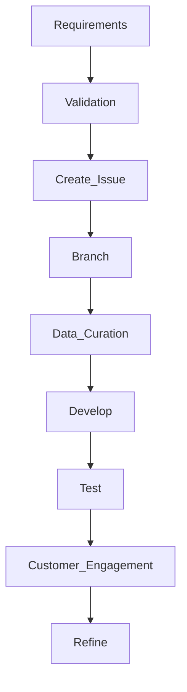

# Jupyter Notebooks
## Data Science / Machine Learning / Artificial Intelligence Study Tools
### Author: Christopher G Wood (christopher.g.wood@gmail.com)

## Description

Repository for all Artificial Intelligence (AI) and Data Science efforts I have pioneered / supported or investigated designed to support use by other students and friends.

Jupyter Notebooks for general data science, machine learning efforts (training), and Large Language Model (LLM) work.

This repository contains a series of Jupyter Notebooks for general Jupyter learning and AI/ML efforts.  Each notebook is numbered stating at 001 progressing numerically as concepts get more involved.  All AI/ML notebooks start with ML_.

If you want to clone this repository and setup the environment yourself please see the instructions for building Anaconda manually, although I recommend using the pre-built environment file.

If you want to use GitHub's Codespaces simply initiate a Codespaces session from the main branch yourself.  Note that there is an assumption of syncing your dotfiles so either fork/clone [my configs folder](https://github.com/christophergarthwood/configs) and [update your settings](https://docs.github.com/en/codespaces/customizing-your-codespace/personalizing-github-codespaces-for-your-account) to point to the cloned configs repository.  By doing this you'll inherit an update to your shell environment that activates and registers anaconda.

##### Table of Contents

[Artificial Intelligence](#what_is_ai)

[Prerequisites](#prerequisites)

[Project Data](#proj_data)

[Repo Folder Structure](#folder_structure)

[Useage](#useage)

+ [Branches](#branches)
+ [Versioning](#versioning)
+ [Coding Standards](#code_standards)
+ [Branching Standards](#branch_standards)
+ [Development Environment](#dev_environment)
+ [Data Standards](#data_process)
+ [External Dependencies](#docker)
+ [Deployment](#deployment)

[General Coding Guidelines](#coding_compliance)

[Really Useful GPU Information](#gpu)

[References](#references)

---

<a name="what_is_ai"/>

## Artificial Intelligence (AI)

### AI Concepts versus Statistics
 
Linear regression is used widely amongst both statistical work and Artificial Intelligence (AI).  The core of AI is statistics on data.
 
The primary difference between statistics and AI is the goal of linear regression.  Linear regression is used to test hypotheses, estimate parameters and explore relationships within the data.  Statistics has a more “hands on” approach to data with respect to linear regression calculations.  AI utilizes linear regression to train models that will in turn provide an optimized inference of the data with less concern over normalized distributions as this is its power.  AI is the ultimate curve fitter and optimization algorithm.
 
Statistics is focused on exploring and generalizing the data whereas AI is focused on learning and providing a response by adapting to the data, hence the ultimate curve fitter.

Examples of statistical use of Linear Regression are hypothesizing the correlation of one variable to another.  Does skateboarding  influence health?  This hypothesis can be applied to a dataset that utilizes people that skateboard versus those that don’t.  Linear regression in this context helps validate the hypothesis.  AI would take the various datasets and provide the likelihood of health problems based on the input parameters with less concern about the desired hypothesis’ resolution.  This intent of the AI solution is to not obtain an equation, although it can be, and apply that directly to algorithmic solutions.

**AI IS A DIRECT IMPLEMENTATION OF STATISTICS DESIGNED TO PROVIDE A DISCRETE ANSWER BASED ON INPUT PARAMETERS USING AN ENCAPSULATED ALGORITHM THAT HAS BEEN SPECIFICALLY TRAINED ON A VERSIONED DATASET.**

### What is Generative AI?

Machine Learning (ML), a.k.a. “narrow AI”, focuses on producing an answer given a versioned dataset it has trained on.  ML utilizes the discrete set of data given to fit a value, given a set of input parameters, to a curve.  ML equals a recognized, understood, and approachable dataset one can investigate at will.

Generative AI utilizes a massive corpus of knowledge used as training data to support the creation of the model.  Content is “generated” from this massive corpus of knowledge based on model parameters provided at runtime, which influence model behavior, and the probability that the content generated is likely based on the prompt input.  Generative AI is a general model approach in that it doesn’t respond to a very discrete set of inputs and in turn provides a focused inference.  Generative AI, especially multi-modal models, has the ability to provide content that appears to be unique / creative by leveraging the aforementioned massive corpus of data into interesting combinations.

Examples of Generative AI versus ML would be Computer Vision, Convolutional Neural Network (CNN), solutions using traditional ML methods.  In a CNN you have a dataset that is known, versioned, curated, and trusted.  The CNN is specifically trained on that data with inferences based on fitting the inputs, the new image, to the established neural pathways designed from training.  You are not “generating” data, you are obtaining an inference, response / answer, from the inputs provided which must, at some level, correlate to the training data used.  If you submit a picture of a flower to a CNN trained to identify flys you cannot expect a high probability of response.

<a name="branches"/>

## Branches
Main branch is the primary branch for this project.  Note that in the future a develop branch will be created for developer submissions with integration into main by a senior developer.

<a name="prerequisites"/>

## Prerequisites / Knowledge

### System Requirements

Assumes the use of Google Cloude Provider (GCP) or a similar provider that has a turnkey environment.

#### Library Requirements

Current known good configuration for these experiments:

```shell
pip install nvidia-cudnn-cu12==8.9.7.29
pip install tensorflow==2.17
pip install tensorrt
pip install spacy[cuda12x]
pip install torch torchvision torchaudio pycuda
```

**Expect to see a v2.4 for Torch.**

<a name="useage"/>

## Useage Instructions

<a name="versioning"/>

### Versioning

Various versioning is present in this repository as each task is independent of others.  Typical versioning follows [Sementic Versioning 2.0.0] (https://semver.org/).

Given a version number MAJOR.MINOR.PATCH, increment the:

+ **MAJOR** version when you make incompatible API changes
+ **MINOR** version when you add functionality in a backward compatible manner
+ **PATCH** version when you make backward compatible bug fixes

Additional labels for pre-release and build metadata are available as extensions to the MAJOR.MINOR.PATCH or MAJOR-MINOR-PATCH, in support of directory structures, format.

<a name="proj_data"/>

### Critical Project Data

+ All Authoritative data is kept in:
  + ```Google Drive: `https://drive.google.com/drive/folders/17vOINL-H2CntR8aWcg_gG2UBoZjalNeJ?usp=share_link``
+ Authoritative folders have the following structure:
  + ```public_source``` - immutable data used for experiments and labs.

<a name="code_standards"/>

### Coding Standards

#### Development instructions


<a name="branch_standards"/>

#### Branch instructions

+ Create branches via the GitHub Issue the work is related to and then delete them when the ticket is closed.
  + Do not allow too many branches, making it impossible for a new developer to know where to start
+ Create annotated tags when a version of your code is released.
+ Use formatting tools and lint your code for that issue on the files you worked on (not the entire code base, we don't want to trigger mass change).
+ DO NOT include data or binary files (unless a code artifact) to the repository.
+ Add testing when/where appropriate (Jupyter Notebooks are not necessarily applicable here).
+ Each tag inspect the README.dm to ensure we're not out of date or simply innacurate README exists

Coding standards are, by their very nature, opinionated, and the following represents my own opinion, based on decades of professional software development, of what our common coding standards ought to be. These standards are mostly independent of programming language (I've included some language specific recommendations as well however) and present a 'best-practice' approach to developing high quality software.

#### Repository Structure
For any codebase there will be a repository, known as the 'upstream' repository.

The benefits of enforcing this are as follows:

+ When a new developer joins the project it's easy for them to see immediately which branch contains the latest work in progress and which branch contains the latest release code.
+ For public facing repositories it presents a clean and consistent public face for our codebase, showing us in the best possible light.
+ Each developer can use their own fork to do whatever work they need to, and the onus is on them to keep their own repositories tidy.

Over and above the default labels provided by GitHub add documentation and feature labels.

Assign teams admins with admin rights, and developers with write access to the repo.

#### Workflow

+ Developers should not, as a general rule be working in other developer's branches, but if it's really needed they can by setting up another git remote
+ Ensure work conforms to common linting standards (For Javascript projects I use eslint and prettier for this, but tools vary from language to language)
+ Ensure work is consistent with current documentation
+ Assign reviewers, appropriate labels, and assign the PR to yourself
+ Using GitHub to create a Pull Request against the upstream develop branch (see below for ticket naming scheme)
+ Respond to any review comments / make changes as appropriate.
+ When all changes / ticket is approved, merge the PR and delete the branch

Features must be named per the following pattern #{issue number}/{some_descriptive-text} — so for example, if you are working on issue ABC-1 with the title "do the thing", call your feature ABC-1/do_the-thing. Obviously use your common sense to avoid making the feature names too long.

#### Commit Messages
When committing something use the -m flag to add a short commit message of the format:

```#<Issue_Id by Ticketing System><Optional:(Use Case Id)><Bug Fix|Feature|Documentation|Optimization><Short description of the change in past tense>.```

*the pound system is required*

Commit messages ought to be in the past tense.

In general try to group file changes wherever appropriate, so if your controller change also involved updating something in a helper file, the one commit message can happily encompas the changes to both files. The message ought to reflect the main aim of the change.

+ Bug Fix - the change fixes a bug
+ Feature - the change adds a new feature (the usual issue type)
+ Documentation — The change is a documentation only change
+ Optimisation - The change is an optimisation of the code base without any functional changes

If your change does not fit any of these categories, use Feature. Likewise if your change is not tied to an issue number you may use n/a instead.

So to use the *above example your commit would have the following message*:

+ ```#132 Feature added cosine similarity to human selected comments versus generative selected comments.```
+ ```#132 (ML-025) Feature added cosine similarity to human selected comments versus generative selected comments.```

<a name="deployment"/>

#### Deployment instructions

Not applicable to this repository, these are experimental projects.  If a project graduates to operational a dedicated repository will be made for it.

<a name="docker"/>

#### Use Docker for external dependencies

For code that requires external dependencies such as Mongo, Redis, Postgres, etc, ensure there is a docker-compose.yml file configured to run those dependencies. Do not assume that a developer has Mongo etc already installed. If the developer is a contractor with multiple clients it's often difficult or impossible for them to run such things on their bare metal.

<a name="dev_environment"/>

#### Development Environment

***???***

<a name="data_process"/>

#### Data Process

Utilize the following tenants when maturing your data source:

+  **Authoritative**

 + There's only one place to get it.
 + That data represents the place to get the data and the only place.

+  **Versioned**

 + Meaning it's known, embedded with the output.
 + It's correlated with the code used to create it.

+  **Easily read**

 + In AI/ML, single dimensional arrays dominate all.
 + Binary output is secondary best.
 + Easily understood and reentrant is likely your best bet.
 + If possible take a well-known data structure and pickle it.  Easily read, easily understood and quickly reentrant.  Pandas -> Pickle.

+  **Easily accessed**
 + You don't have to "hunt" for it.
 + Access control is applied.
 + Easily searched for in a central portal with descriptions of meta-data, links for download and previews of the content.

+  **Cleansed**
 + Prompt Injection checked (NLP methods, existing AI neural layers).
 + PII cleansed (Named Entity Recognition [NER] methods), DLP, and regular expressions.
 + CUI cleansed
 + Original data maintained and immutable.
 + Cleaned data (at whatever level) documented and saved as an additional set of data

+  **Peer Reviewed**
 + Data Scientist reviewed in terms of cleansing and preparatory work.

+  **Documented**
 + See all the aforementioned information and co-locate that data in one place that's consistently formatted and easily read/discoverable (ERDDAP?)

#### The 4 V's

+ Velocity - how fast is the data coming in?
+ Volume - how much data is there?  This consideration is for the number of samples as well as the actual "mass" of the data, different concepts both apropos.
+ Variety - how many different formats is your data in?
+ Veracity - how much do you trust this data?

<a name="folder_structure"/>

## Folder structure

Documentation folder has 3 level tree-like structure, inspired by ZenDesk documentation structure:

```
./
├── .devcontainer/
│   ├── Dockerfile
│   ├── devcontainer.json
├── README.md
├── cfg  - files related to configuration setup for script and notebooks (dotenv)
|   ├── .env
|   ├── .env_app
|   ├── .env_ai
|   ├── .env_api_keys
|   ├── .env_cloud
|   ├── config.env
├── environment - files related to Anaconda builds
├── script - one (Script to Rule Them All)[https://github.com/github/scripts-to-rule-them-all]
├── README.md
├── *.ipynb
├── debug.py
├── libs.py
```
File/Folder Explanations:
+ .devcontainer - potential for CodeSpaces within GitHub.

+ .env* - files that support Pythonic projects for environment file loaded (configuration setup, dotenv).

+  environment - Environment specification for standard Anaconda setups.

+  script - Examples/template for GitHub's One Script to Rule them All.

+  debug.py - Standard logging library.


<a name="coding_compliance"/>

## Coding Compliance

### General Standards

+ **Governance and Business Case**:
  +  Every effort you conduct should have a process defined, even at the most basic level.
  +  Business Owner engagement is required for the start of anything.
  +  I like to call work with AI "engagements".
  +  AI is not software, AI is an "engagement", an opportunity for a multi-disciplinary team to collaborate on business process improvement.

+ **Security**:
  +  Development environment needs to be in a different, controlled, and secure area than your operations target.
  +  Changes to the development environment must be documented and controlled.
  +  Privacy Enhancing Technology (PET) shoudl be considered for CUI, PII, and Corporate data.

+ **Product Owner (business responsibility)**:
  +  Business Owner engagement should be part of that user's process.
  +  The AI PM will act as a Product Owner for end-user/customers.
  +  Agile Scrum methodology will be used for prioritization and task management.

+ **Technical Owner **:
  +  The Technical Owner of an AI engagement is not necessarily the programmer.  It's the person with the most overall "engagement" understanding.

+ **Authoritative**: 
  + Use authoritative datasets.
  + Use data driven decision making.
  + Use risk analysis for ranking work.

+ **Hosting**:
  +  AI solutions will ultimately be the deployment of a neural layer, a HDF5 binary data file and the corresponding libraries used to develop the solution.
  +  Model your deployment environment in DEV to the same as operations.

+ **Environment**:
  +  Any solution targeted for operational release will have their own repositories or minimally branches.

### Accessibility & Design Standards

All technical solutions and development efforts must meet the following accessibility and design standards of an organization:

+ **Accessibility**: 
    + Section 508 compliance is difficult to achieve due to the nature of certain Python libraries, however efforts are being made to provide *alt* text inputs and comments that work with JAWS screen readers.
    + Note that operational capabilities are expected to be compliant if a web presence is established.

+ **Consistency**:
    +  Consistency is all that matters in computer science.

+ **Mobile friendly**: Technical Solutions must be usable and function on mobile devices.
    + A cross platform solution might be ideal, worthy of investigation especially if accessibility concerns are addressed.

+ **Searchable**: 
    + How are you exposing the content and does it support searching via different mechanisms?

+ **User-centered**:
    +  Ensure the data is explained and the outputs are clearly indicated what they stand for.

### Technical Standards

All technical solutions and development efforts must meet the following technical standards:

+ **Solution Architecture**:
  + Document an overall view (OV) and system view (SV) diagram.
  + Overall views are the 50K perspectives of how things will work, easily understood by anyone.
  + System views are at varying degrees of technical granuality with the intent of displaying data and communication exchanges. 

+ **Source Code Management**: 
  + See this repository.

+ **Main Branch Management**:
  + A main branch exists with a defined Branch.

+ **Technology Stacks**:
  + Technology stack is investigated during the Prototyping process.  Don't limit yourself but be cognizant of operations.
  + Software is what "wraps" an AI solution, use what makes sense to tell the story.

+ **Continuous Integration, Continuous Delivery, and Compliance Validation**:
  +  Establish a pipeline and use it!

+ **Continuous Deployment and Release Management**:
  +  ***Need to put some thought and work into this.***

+ **Minify**:
  + Typical for expensive JS solutions but less relevant for Data Science workloads.
  + Consider for operational deployments.

+ **Employ Continuous Monitoring and Alerting**:
  + Need anymore be said?

<a name="references"/>


<a name="gpu"/>

## Really Useful GPU Information

### Useful Command(s)

+ Continously watch your GPU use:
```
alias watch_gpu='watch -n 1 nvidia-smi'
```

+ Display all available modules, find command:
```
find /lib/modules/$(uname -r) -type f -name "\*.ko";
```

+ Show Hardware:
```
lshw;
```

+ Show Video Card
```
sudo lshw -c video;
```

+ See the list of available HW.
```
sudo ubuntu-drivers list;
```

+ See what is actually available:
```
sudo apt-get install linux-headers-$(uname -r);
```

+ What version of driver are you using?
```
cat /proc/driver/nvidia/version;
```

+ Are the kernel modules loaded?
```
lsmod | grep nvidia;
```

+ This will show you GPU availability:
```
nvidia-smi;
```

+ Show graphics driver details:
```
nvidia-smi --query-gpu=driver_version --format=csv
```

+ Load new Kernel on the fly for Jupyter Notebook (not generic):
```
mamba env create -f /home/jovyan/environment.yml;
echo ". /opt/conda/etc/profile.d/conda.sh" >> /home/jovyan/.bash_profile;
echo "conda deactivate" >> /home/jovyan/.bash_profile;
echo "conda activate <your environment name>" >> /home/jovyan/.bash_profile;
. /opt/conda/etc/profile.d/conda.sh;
conda activate <your environment name>;
python -m ipykernel install --user --name <your environment name>;
source /home/jovyan/.bash_profile;
```
### Anaconda 

+ ***Create Stripped down version of an environment***:
```
sudo $(which conda) env export --from-history --name aiml_loaded > striped.yml;
```

+ ***Most secure method cross-platform***:
```
sudo $(which conda) env export --no-builds  --name aiml_loaded > ./environment/archless_environment.yml;
```

+ ***Most generic method (verified to work everywhere)***:
```
sudo $(which conda) env export --name aiml_loaded > ./environment/environment.yml;
```

+ Clean Up the Anaconda release to make disk space
```
sudo $(which conda) clean --all -y;
```

#### Tailored Environments

##### aiml_basic
```
conda create -n aiml_basic -c conda-forge python=3.9 numpy pandas tabulate scipy matplotlib jupyter jupyterlab jupyter_dashboards nbconvert tqdm icecream scikit-learn netCDF4 xarray icecream geopandas pylint autopep8 black unidecode -y
```


### Example Jupyter Port Forwarding:
```
ssh -i ${the_key} -N -L localhost:8080:localhost:8080 ${the_user}@${the_ip}
```

### Hyper-Parameter Issues with Python
*** Note: Hyper-parameter tuning might cause an H5 lock issue.  Try: HDF5_USE_FILE_LOCKING='FALSE' on the OS. ***

### GPU's / NVIDIA / Multiple GPU's

Things to know:

+ Display of all GPU's (which also give you the Id's) and their utilization.
```
watch -n 1 "nvidia-smi"
``` 

+ Is supposed to reset the GPU's if something hangs them up...good luck.
```
nvidia-smi --gpu-reset` or `nvidia-smi -r
``` 

+ If you want to constrain which GPU's are used do the following:

    + In your calling SH script use
```
export CUDA_VISIBLE_DEVICES=${INTRO_GPU_NUMBER};
```
    + In your Python script use:
```
tf.debugging.set_log_device_placement(True)
gpus = tf.config.experimental.list_physical_devices('GPU')
print("Num Physical GPU's Available: {} ".format(len(tf.config.experimental.list_physical_devices('GPU'))))
print("Num Logical  GPU's Available: {} ".format(len(tf.config.experimental.list_logical_devices('GPU'))))
print("Num CPU's Available: {} ".format(len(tf.config.experimental.list_physical_devices('CPU'))))
print("...utiliting GPU #:0")
    with tf.device(f"/job:localhost/replica:0/task:0/device:GPU:0"):
        #some code here4
```
     Notice how GPU:0 is referenced.  That's becuase you limited all GPU visibility at the shell level and the Python code can only see a single GPU.  It's a strategy.  Normally you can simply reference the GPU# in question but I've found that's not very reliable.

+ If you're having problems with GPU memory you can try, in your SH script: 
```
export TF_FORCE_GPU_ALLOW_GROWTH="true"
```


## Reference

### Artificial Intelligence
+ [Machine Learning Mastery](http://machinelearningmastery.com)
+ [AI Model Visualization](https://github.com/parrt/dtreeviz)

### Jupyter and Other Tech
+ [Jupyter Notebooks](https://jupyter.org/)
+ (Jupyter Notebook Password Setup / Config)[https://medium.com/@nyghtowl/setup-jupyter-notebook-access-on-google-compute-engine-with-https-ad69297f438b]
+ [Jupyter Code Prettify](https://medium.com/geekculture/simple-way-to-format-your-jupyter-notebook-codes-in-python-9baa6e759ef6)
  +[Code Prettify Page](https://jupyter-contrib-nbextensions.readthedocs.io/en/latest/nbextensions/code_prettify/README_code_prettify.html)
+ (Sharing Anaconda Environments)[https://carpentries-incubator.github.io/introduction-to-conda-for-data-scientists/04-sharing-environments/index.html]

### Vendors
+ (NVIDIA Install Guide)[https://docs.nvidia.com/cuda/cuda-installation-guide-linux/index.html]

#### Cloud Provider CLI commands
+ [gcloud](https://cloud.google.com/storage/docs/gsutil_install#linux)
+ [aws](https://docs.aws.amazon.com/cli/v1/userguide/install-linux.html)
+ [az](https://learn.microsoft.com/en-us/cli/azure/install-azure-cli-linux?pivots=script) 
+ [GitHub Quickstart](https://docs.github.com/en/actions/quickstart)
+ [GitHub Actions / Workflow](https://docs.github.com/en/actions/learn-github-actions/understanding-github-actions)
